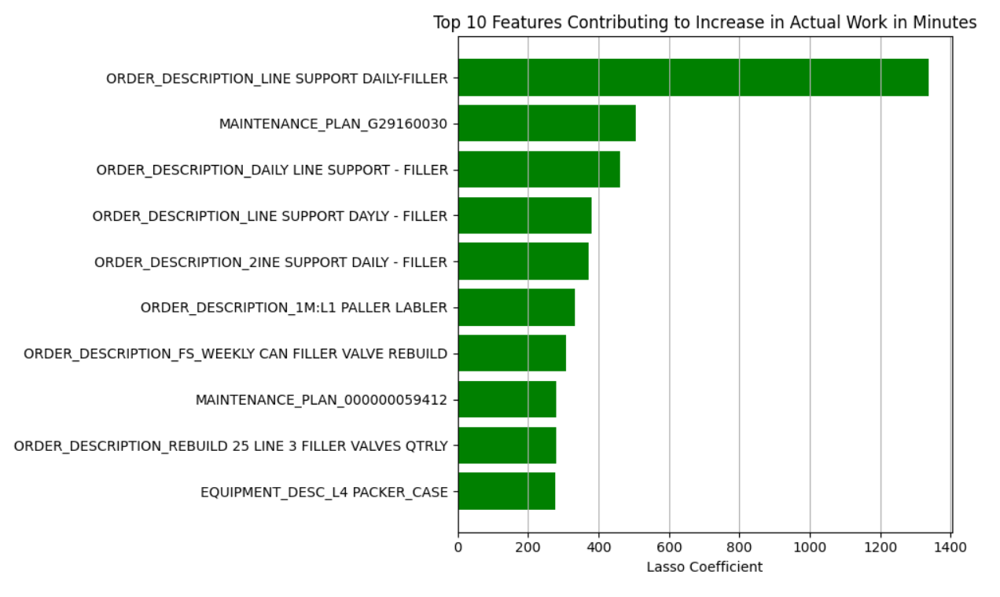

## Capstone Project: Swire Coca-Cola
Repository containing Alex Hamil’s portfolio of work for the data science project Swire Coca-Cola machine maintenance and downtime

# Table of Contents
- [Business Problem Statement](#Business-Problem-Statement)
- [Our Solution to the Problem](#Our-Solution-to-the-Problem)
- [My Contribution to the Project](#My-Contribution-to-the-Project)
- [Solution's Value to the Business](#Solutions-Value-to-the-Business)
- [Challenges Our Group Faced](#Challenges-Our-Group-Faced)
- [What I learned from the Project](#What-I-earned-from-the-Project)

## [Business Problem Statement](#Business-Problem-Statement)
Swire Coca-Cola has 6 production plants to meet the demand of 192 million cases of various beverages from 13 different states. These plants are currently only able to meet 94.4% of the demand. One of the reasons these plants fall short of meeting the total product demand is because they are plagued with unplanned down time. This downtime is caused by various failure modes like maintenance, mechanical failure, general wear and tear, etc.

Extensive repairs result in lengthy downtimes that generate work orders in the IWC system.  The long lead times caused by these work orders cost Swire Coca-Cola $60 million annually in production losses. 

The purpose of this project is to create a model that allows Swire Coca-Cola to better understand plant machine maintenance and make predictions of costly failures before they occur.

## [Our Solution to the Problem](#Our-Solution-to-the-Problem)
* Our solution to the problem started by cleaning and understanding the data and its gaps prior to model selection.
* Next we had to decide which variables in the data we wanted to focus on and what our target variable would be. We chose ACTUAL_WORK_IN_MINUTES for our taget variable and to exclude the functional area nodes since this data is captured in the FUNCTIONAL_LOC variable.
* Finally we decided to try both supervised and unsupervised models. We used supervised models to try to create a predictive model that could indicate factors leading to downtime and unsupervised models to look for unseen relationships between maintenance and failure patterns of machinery.

## [My Contribution to the Project](#My-Contribution-to-the-Project)
My contributions to the Exploratory Data Analysis were the exploratory visualizations and summary graphics surrounding the FUNCTIONAL_AREA_NODE locations and the results sections of the EDA analysis. For the modeling notebook I focused on the linear, lasso, and dummy regression models and summarized the supervised modeling results. I wrote a large portion of the work that we used for the business problem statement and created the slides with the business recommendations for the final presentation.

## [Solution's Value to the Business](#Solutions-Value-to-the-Business)

The results from the lasso model are a list of coefficients with a direct of inverse correlation to “ACTUAL_WORK_IN_MINUTES”. The lasso model selected 99 coefficients that have significant impact on the target variable, and we highlighted the top ten coefficients with a negative and positive impact on the target variable.
Negative Impact on “ACTUAL_WORK_IN_MINUTES” - increasing the amount of downtime
Positive Impact on “ACTUAL_WORK_IN_MINUTES” - decreasing the amount of downtime

Further examining the equipemnt and processes associated with these variables will allow Swire to pinpoint areas for optimization and potential time saving procedures already in use.

## [Challenges Our Group Faced](#Challenges-Our-Group-Faced)
* With the overwhelming amount of data in the majority class. We found it helpful to downsample the data for this class. This helped reduce overfitting our model to the majority characteristics of customers that are capable of repayment. 
* The limited data available about the minority class meant that we had to resample some of the same data from this class while using various data samples from the majority class. This allowed us to use a larger sample of data and potentially capture more patterns and interactions in the data.
* Capturing the nuances of the data by averaging multiple prediction models helped us to reduce variance and account for different aspects of the data. As you can see we were able to account for 85% of the variance in the data with our ensemble model. 

## [What I learned from the Project](#What-I-earned-from-the-Project)
I learned the importance of understanding your data and its "gaps" or "completeness", being selective with the data you plan to work with, and converting data to meaningful business insights

Only 291,782 out of 1.4 million work orders had complete "FUNCTIONAL_LOC" data, indicating incomplete datasets where some have limited predictive modeling potential.  We ended up dropping 5 Functional Area Node variables after examining the data because of the lack of detailed data and the duplication of it with the single variable FUNCTIONAL_LOC. By selecting this variable and eliminating the others it saved us valuable time and allowed us to focus on relevant predictive data.

By examining the data and understanding the business case description, we were able to convert the lost time into a dollar/minute variable that allowed the business to understand the real world cost associated with these process inefficiences and downtime.
